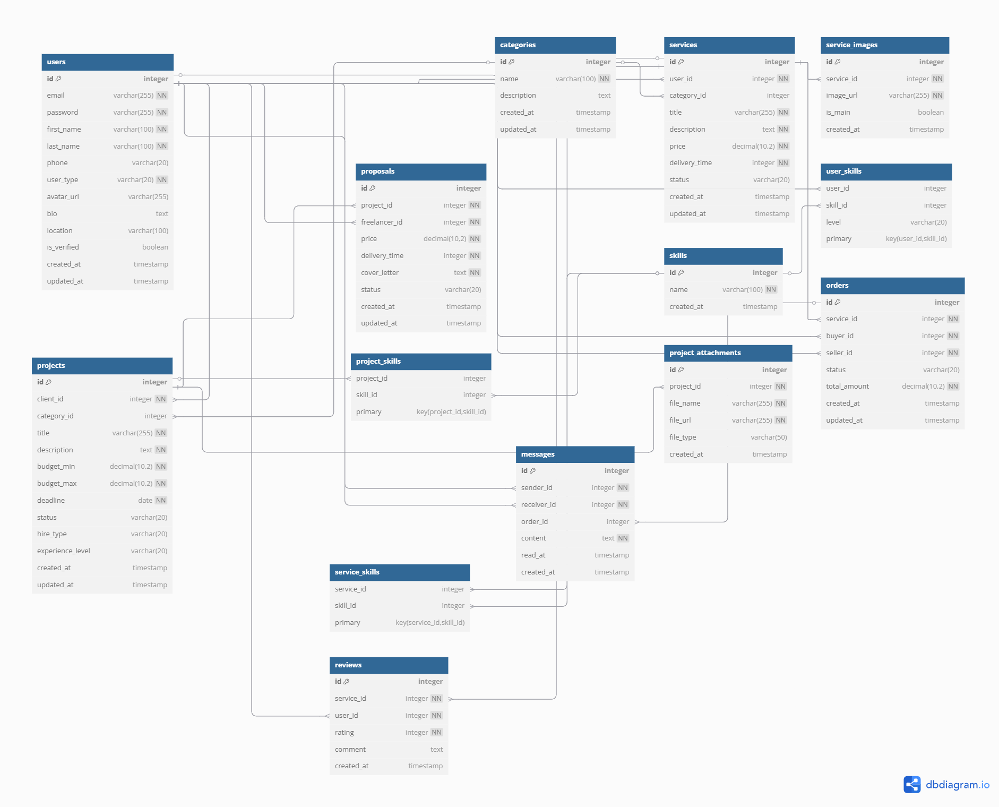

# Diseño de Base de Datos

## Diagrama Entidad-Relación
<!-- Añadir imagen generada del diagrama -->

## Tablas

| Tabla                 | Descripción                                                                                                                |
| --------------------- | -------------------------------------------------------------------------------------------------------------------------- |
| `users`               | Almacena información de freelancers y clientes, incluyendo datos personales y tipo de usuario.                             |
| `categories`          | Contiene las categorías para clasificar servicios y proyectos.                                                             |
| `services`            | Guarda los servicios ofrecidos por freelancers, con detalles como título, descripción y precio.                            |
| `service_images`      | Imágenes asociadas a los servicios, con una opción para marcar la imagen principal y texto alternativo para accesibilidad. |
| `projects`            | Proyectos publicados por clientes, incluyendo presupuesto, fecha límite y requisitos.                                      |
| `proposals`           | Propuestas de freelancers a proyectos, con precio, tiempo de entrega y carta de presentación.                              |
| `skills`              | Lista de habilidades que pueden tener los usuarios, servicios o proyectos.                                                 |
| `user_skills`         | Relación entre usuarios y sus habilidades, incluyendo el nivel de experiencia.                                             |
| `service_skills`      | Relación entre servicios y habilidades requeridas.                                                                         |
| `project_skills`      | Relación entre proyectos y habilidades necesarias.                                                                         |
| `project_attachments` | Archivos adjuntos a proyectos, como documentos o imágenes.                                                                 |
| `orders`              | Órdenes realizadas para servicios, con estado, monto total y referencias a comprador y vendedor.                           |
| `reviews`             | Opiniones y calificaciones que los usuarios dejan sobre servicios.                                                         |
| `messages`            | Mensajes entre usuarios relacionados con órdenes, con opción de marcar como leídos y posibles temas o hilos.               |

## Estructura Detallada

### Tabla: users

| Campo        | Tipo            | Restricciones                                  |
|--------------|-----------------|------------------------------------------------|
| id           | integer         | PK, autoincrement                              |
| email        | varchar(255)    | único, no nulo                                 |
| password     | varchar(255)    | no nulo                                        |
| first_name   | varchar(100)    | no nulo                                        |
| last_name    | varchar(100)    | no nulo                                        |
| phone        | varchar(20)     | opcional                                       |
| user_type    | varchar(20)     | no nulo, 'freelancer' o 'client'              |
| avatar_url   | varchar(255)    | opcional                                       |
| bio          | text            | opcional                                       |
| location     | varchar(100)    | opcional                                       |
| is_verified  | boolean         | por defecto: false                             |
| created_at   | timestamp       | por defecto: now()                             |
| updated_at   | timestamp       | por defecto: now()                             |

### Relaciones

- Un `User` puede tener muchos `Services` (1:N)
- Un `User` puede tener muchos `Projects` (1:N) — como cliente
- Un `User` puede tener muchos `Proposals` (1:N) — como freelancer
- Un `User` puede tener muchas `User_Skills` (1:N)
- Un `User` puede dejar muchas `Reviews` (1:N)
- Un `User` puede enviar y recibir muchos `Messages` (1:N)
- Un `User` puede ser comprador o vendedor en muchos `Orders` (1:N)

### Tabla: categories

| Campo       | Tipo          | Restricciones                    |
|-------------|---------------|----------------------------------|
| id          | integer       | PK, autoincrement                |
| name        | varchar(100)  | no nulo                          |
| description | text          | opcional                         |
| created_at  | timestamp     | por defecto: now()               |
| updated_at  | timestamp     | por defecto: now()               |

### Relaciones

- Una `Category` puede tener muchos `Services` (1:N)
- Una `Category` puede tener muchos `Projects` (1:N)

### Tabla: services

| Campo         | Tipo           | Restricciones                                 |
|---------------|----------------|-----------------------------------------------|
| id            | integer        | PK, autoincrement                             |
| user_id       | integer        | FK -> users.id, no nulo                       |
| category_id   | integer        | FK -> categories.id                           |
| title         | varchar(255)   | no nulo                                       |
| description   | text           | no nulo                                       |
| price         | decimal(10,2)  | no nulo                                       |
| delivery_time | integer        | no nulo, en días                              |
| status        | varchar(20)    | por defecto: 'draft'                          |
| created_at    | timestamp      | por defecto: now()                            |
| updated_at    | timestamp      | por defecto: now()                            |

### Relaciones

- Un `Service` pertenece a un `User` (N:1)
- Un `Service` pertenece a una `Category` (N:1)
- Un `Service` puede tener muchas `Service_Images` (1:N)
- Un `Service` puede tener muchas `Service_Skills` (1:N)
- Un `Service` puede tener muchas `Orders` (1:N)
- Un `Service` puede tener muchas `Reviews` (1:N)

### Tabla: projects

| Campo            | Tipo           | Restricciones                                   |
|------------------|----------------|-------------------------------------------------|
| id               | integer        | PK, autoincrement                               |
| client_id        | integer        | FK -> users.id, no nulo                         |
| category_id      | integer        | FK -> categories.id                             |
| title            | varchar(255)   | no nulo                                         |
| description      | text           | no nulo                                         |
| budget_min       | decimal(10,2)  | no nulo                                         |
| budget_max       | decimal(10,2)  | no nulo                                         |
| deadline         | date           | no nulo                                         |
| status           | varchar(20)    | por defecto: 'open'                             |
| hire_type        | varchar(20)    | 'project' o 'long_term'                         |
| experience_level | varchar(20)    | 'junior', 'intermediate' o 'senior'            |
| created_at       | timestamp      | por defecto: now()                              |
| updated_at       | timestamp      | por defecto: now()                              |

### Relaciones

- Un `Project` pertenece a un `User` (cliente) (N:1)
- Un `Project` puede tener muchas `Proposals` (1:N)
- Un `Project` puede tener muchas `Project_Skills` (1:N)
- Un `Project` puede tener muchas `Project_Attachments` (1:N)

### Tabla: proposals

| Campo         | Tipo           | Restricciones                                  |
|---------------|----------------|------------------------------------------------|
| id            | integer        | PK, autoincrement                              |
| project_id    | integer        | FK -> projects.id, no nulo                     |
| freelancer_id | integer        | FK -> users.id, no nulo                        |
| price         | decimal(10,2)  | no nulo                                        |
| delivery_time | integer        | no nulo, en días                               |
| cover_letter  | text           | no nulo                                        |
| status        | varchar(20)    | por defecto: 'pending'                         |
| created_at    | timestamp      | por defecto: now()                             |
| updated_at    | timestamp      | por defecto: now()                             |

### Relaciones

- Una `Proposal` pertenece a un `Project` (N:1)
- Una `Proposal` pertenece a un `User` (freelancer) (N:1)

### Tabla: orders

| Campo         | Tipo           | Restricciones                                  |
|---------------|----------------|------------------------------------------------|
| id            | integer        | PK, autoincrement                              |
| service_id    | integer        | FK -> services.id, no nulo                     |
| buyer_id      | integer        | FK -> users.id, no nulo                        |
| seller_id     | integer        | FK -> users.id, no nulo                        |
| status        | varchar(20)    | por defecto: 'pending'                         |
| total_amount  | decimal(10,2)  | no nulo                                        |
| created_at    | timestamp      | por defecto: now()                             |
| updated_at    | timestamp      | por defecto: now()                             |

### Relaciones

- Una `Order` pertenece a un `Service` (N:1)
- Una `Order` pertenece a un `User` como comprador (N:1)
- Una `Order` pertenece a un `User` como vendedor (N:1)
- Una `Order` puede tener muchos `Messages` (1:N)

### Tabla: reviews

| Campo       | Tipo           | Restricciones                                  |
|-------------|----------------|------------------------------------------------|
| id          | integer        | PK, autoincrement                              |
| service_id  | integer        | FK -> services.id, no nulo                     |
| user_id     | integer        | FK -> users.id, no nulo                        |
| rating      | integer        | no nulo, entre 1 y 5                           |
| comment     | text           | opcional                                       |
| created_at  | timestamp      | por defecto: now()                             |

### Relaciones

- Un `Review` pertenece a un `Service` (N:1)
- Un `Review` pertenece a un `User` (N:1)

### Tabla: messages

| Campo       | Tipo           | Restricciones                                  |
|-------------|----------------|------------------------------------------------|
| id          | integer        | PK, autoincrement                              |
| sender_id   | integer        | FK -> users.id, no nulo                        |
| receiver_id | integer        | FK -> users.id, no nulo                        |
| order_id    | integer        | FK -> orders.id                                |
| content     | text           | no nulo                                        |
| read_at     | timestamp      | opcional                                       |
| created_at  | timestamp      | por defecto: now()                             |

### Relaciones

- Un `Message` pertenece a un `Order` (N:1)
- Un `Message` pertenece a un `User` como emisor (N:1)
- Un `Message` pertenece a un `User` como receptor (N:1)

### Tabla: skills

| Campo       | Tipo           | Restricciones                                  |
|-------------|----------------|------------------------------------------------|
| id          | integer        | PK, autoincrement                              |
| name        | varchar(100)   | no nulo                                        |
| created_at  | timestamp      | por defecto: now()                             |

### Relaciones

- Una `Skill` puede pertenecer a muchos `User_Skills` (1:N)
- Una `Skill` puede pertenecer a muchos `Service_Skills` (1:N)
- Una `Skill` puede pertenecer a muchos `Project_Skills` (1:N)

### Tabla: user_skills

| Campo     | Tipo           | Restricciones                                  |
|-----------|----------------|------------------------------------------------|
| user_id   | integer        | FK -> users.id                                 |
| skill_id  | integer        | FK -> skills.id                                |
| level     | varchar(20)    | 'beginner', 'intermediate', 'advanced', 'expert' |

### Relaciones

- Una `User_Skill` pertenece a un `User` (N:1)
- Una `User_Skill` pertenece a una `Skill` (N:1)

### Tabla: service_skills

| Campo       | Tipo           | Restricciones                                  |
|-------------|----------------|------------------------------------------------|
| service_id  | integer        | FK -> services.id                              |
| skill_id    | integer        | FK -> skills.id                                |

### Relaciones

- Una `Service_Skill` pertenece a un `Service` (N:1)
- Una `Service_Skill` pertenece a una `Skill` (N:1)

### Tabla: project_skills

| Campo       | Tipo           | Restricciones                                  |
|-------------|----------------|------------------------------------------------|
| project_id  | integer        | FK -> projects.id                              |
| skill_id    | integer        | FK -> skills.id                                |

### Relaciones

- Una `Project_Skill` pertenece a un `Project` (N:1)
- Una `Project_Skill` pertenece a una `Skill` (N:1)

### Tabla: project_attachments

| Campo       | Tipo           | Restricciones                                  |
|-------------|----------------|------------------------------------------------|
| id          | integer        | PK, autoincrement                              |
| project_id  | integer        | FK -> projects.id, no nulo                     |
| file_name   | varchar(255)   | no nulo                                        |
| file_url    | varchar(255)   | no nulo                                        |
| file_type   | varchar(50)    | opcional                                       |
| created_at  | timestamp      | por defecto: now()                             |

### Relaciones

- Un `Project_Attachment` pertenece a un `Project` (N:1)

### Tabla: service_images

| Campo       | Tipo           | Restricciones                                  |
|-------------|----------------|------------------------------------------------|
| id          | integer        | PK, autoincrement                              |
| service_id  | integer        | FK -> services.id, no nulo                     |
| image_url   | varchar(255)   | no nulo                                        |
| is_main     | boolean        | por defecto: false                             |
| created_at  | timestamp      | por defecto: now()                             |

### Relaciones

- Una `Service_Image` pertenece a un `Service` (N:1)

