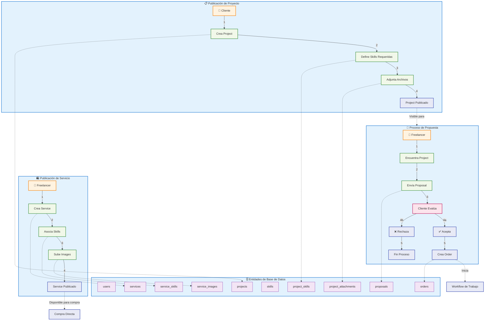

## Diagrama de Flujo de Datos

```mermaid
flowchart TD
    %% Proceso 1: Publicación de Servicio
    subgraph SP["🛍️ Publicación de Servicio"]
        F1[👤 Freelancer] -->|1| CS[Crea Service]
        CS -->|2| AS[Asocia Skills]
        AS -->|3| SI[Sube Images]
        SI -->|4| PS[Service Publicado]
    end
    
    %% Proceso 2: Publicación de Proyecto
    subgraph PP["📋 Publicación de Proyecto"]
        C1[👤 Cliente] -->|1| CP[Crea Project]
        CP -->|2| DS[Define Skills Requeridas]
        DS -->|3| AA[Adjunta Archivos]
        AA -->|4| PP1[Project Publicado]
    end
    
    %% Proceso 3: Proceso de Propuesta
    subgraph PR["📝 Proceso de Propuesta"]
        F2[👤 Freelancer] -->|1| EP[Encuentra Project]
        EP -->|2| EPR[Envía Proposal]
        EPR -->|3| AR[Cliente Evalúa]
        AR -->|4a| ACC[✅ Acepta]
        AR -->|4b| REC[❌ Rechaza]
        ACC -->|5| CO[Crea Order]
        REC -->|5| FP[Fin Proceso]
    end
    
    %% Conectores entre procesos
    PS -.->|Disponible para compra| ORDER1[Compra Directa]
    PP1 -.->|Visible para| PR
    CO -.->|Inicia| WF[Workflow de Trabajo]
    
    %% Entidades de BD involucradas
    subgraph DB["🗄️ Entidades de Base de Datos"]
        direction LR
        USERS[users]
        SERVICES[services]
        PROJECTS[projects]
        PROPOSALS[proposals]
        ORDERS[orders]
        SKILLS_T[skills]
        SERVICE_SKILLS[service_skills]
        PROJECT_SKILLS[project_skills]
        SERVICE_IMAGES[service_images]
        PROJECT_ATTACHMENTS[project_attachments]
    end
    
    %% Relaciones con BD
    CS -.-> SERVICES
    AS -.-> SERVICE_SKILLS
    SI -.-> SERVICE_IMAGES
    CP -.-> PROJECTS
    DS -.-> PROJECT_SKILLS
    AA -.-> PROJECT_ATTACHMENTS
    EPR -.-> PROPOSALS
    CO -.-> ORDERS
    
    %% Estilos
    classDef process fill:#e3f2fd,stroke:#1976d2,stroke-width:2px
    classDef actor fill:#fff3e0,stroke:#f57c00,stroke-width:2px
    classDef action fill:#f1f8e9,stroke:#388e3c,stroke-width:2px
    classDef decision fill:#fce4ec,stroke:#c2185b,stroke-width:2px
    classDef result fill:#e8eaf6,stroke:#3f51b5,stroke-width:2px
    classDef database fill:#f3e5f5,stroke:#7b1fa2,stroke-width:1px
    
    class SP,PP,PR,DB process
    class F1,C1,F2 actor
    class CS,AS,SI,CP,DS,AA,EP,EPR action
    class AR decision
    class PS,PP1,ACC,REC,CO,FP,ORDER1,WF result
    class USERS,SERVICES,PROJECTS,PROPOSALS,ORDERS,SKILLS_T,SERVICE_SKILLS,PROJECT_SKILLS,SERVICE_IMAGES,PROJECT_ATTACHMENTS database

```