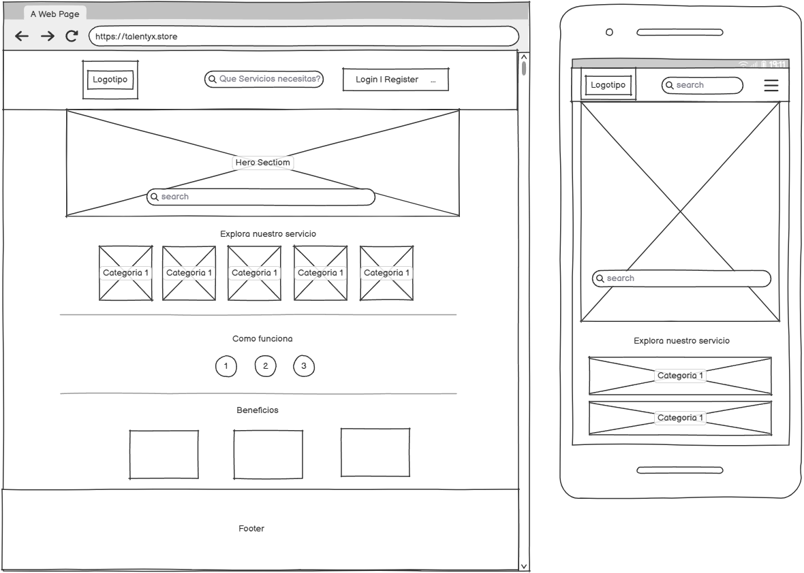

## 1. Diseño de la Interfaz Gráfica (Wireframes)

## 1.1 Página Principal

## 1.2 Registro de Usuarios

## 1.3 Inicio de Sesión

## 1.4 Mi Perfil

## 1.5 Formulario para Crear Publicación

## 1.6 Galería de Publicaciones

## 1.7 Crear Solicitud de Proyecto (Cliente)

.png)

## 1.8 Galería de Proyectos (Para Freelancers)

.png)

## 1.9 Detalle de Proyecto

.png)

## 1.10 Vista de Detalle de Publicación (Servicio)

.png)

